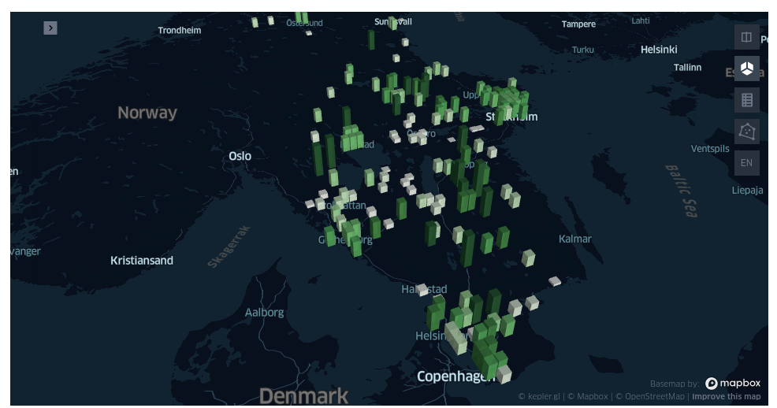

# sweden_hotel_rating_viewer

This is an example project that uses [keplergl](https://kepler.gl/) package to view the average hotel ratings for cities in Sweden. The code can be adapted for any country.

# Usage
* Create a python virtual environment and install the necessary packages using `requirements.txt` file
* Start a notebook environment
``` 
jupyter notebook
```
* Run the `sweden_hotel_ratings.ipynb`
* You can view the saved map `sweden_hotel_rating_map.html` on your browser


